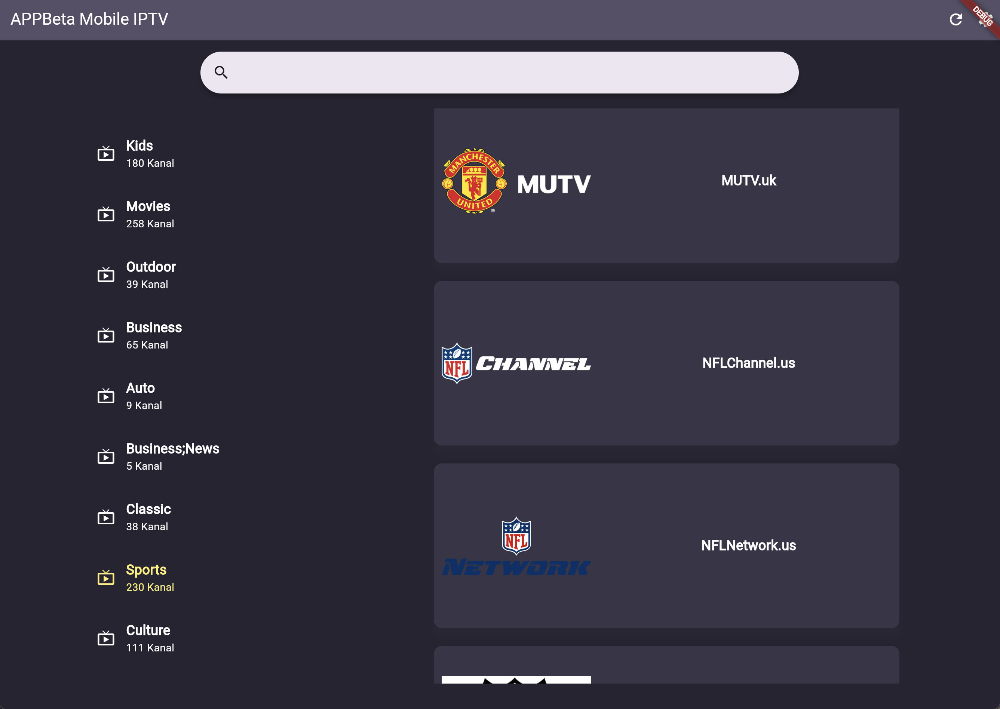
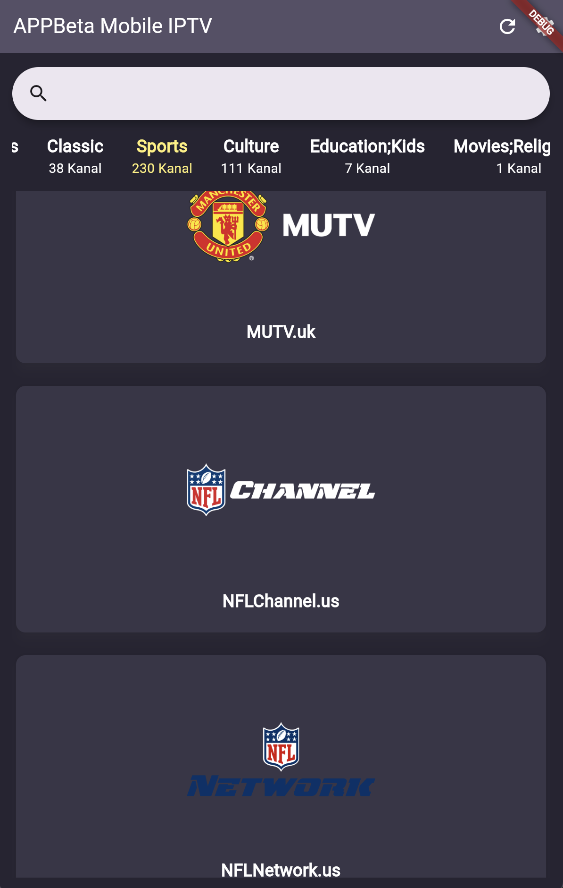
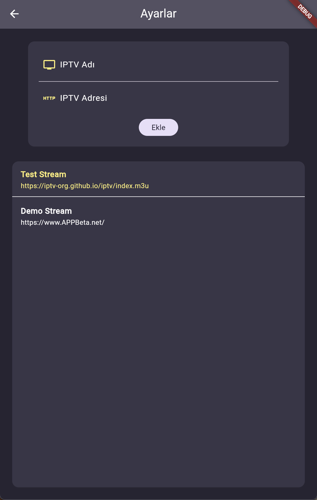
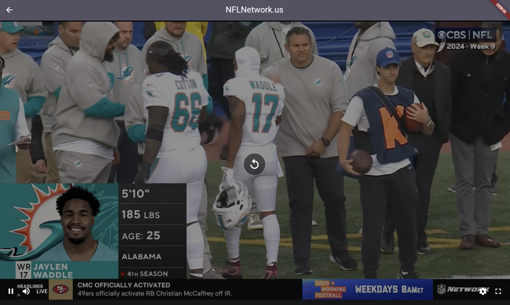

# IPTv

### Description
We have the right to take legal action in the event that the application is shared on the internet, distribution, claiming right ownership, selling it for a fee.
These codes are shared only for you to learn the Flutter.
Anyone who have access to the codes is agreed to have unconditionally accepted these terms.

All Rights Reserved. 
APPBeta Mobile - www.APPBeta.net - Berk ORHAN BETA

Türkçe (TR):
* M3U Listesi üzerinden canlı yayın ve video izlemeye olanak sağlar.
* Webte Video_Player/Chewie ve Android/iOS/TvOS'ta Better_Player paketi kullanmaktadır. 
* Mobil OS'larda http-referrer şartı olan yayınlar desteklenir.
* M3U Listelerini saklamak için Shared Preferences kullanmaktadır.
* Web, Mobil OS ve Tv OS için ayrı arayüz tasarımı mevcuttur.
* Flutter kodlamayı öğrenebilmeniz için bazı bölümlere TV OS'un D-PAD desteği eklenmemiştir.

English (EN):
* Allows live streaming and video playback via M3U lists.
* Uses Video_Player/Chewie on the web and Better_Player package on Android/iOS/TvOS.
* Supports streams that require an HTTP referrer on mobile operating systems.
* Uses Shared Preferences to store M3U lists.
* Has separate interface designs for Web, Mobile OS, and TV OS.
* Certain sections lack D-PAD support for TV OS to aid in learning Flutter coding.

## About Application
Türkçe (TR):
- Framework: Flutter
- Kodlama Dili: Dart
- Platform: Android, iOS, Web
- Oynatıcı: Chewie / Better_Player

English (EN):
- Framework: Flutter
- Programming Language: Dart
- Platform: Android, iOS, Web
- Player: Chewie / Better_Player

## DEMO
Download iptv_v1.0.0.apk [Android APK DEMO](https://github.com/berkorhanbeta/iptv/raw/main/iptv_v1.0.0.apk)

## Screenshots from Application

